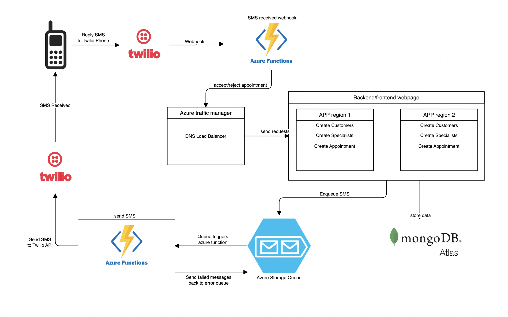

# Twilio demo
An API that makes use of Azure services and Twilio API

## Overall architecture

## Project structure

#### `/api`
Contains the controllers and routes for all of our models

#### `/bin`
Server configuration and initialization

#### `/config`
General configuration of the app (all required environment vars are here)

#### `/core`
It contains the main logic, every use case in the app lives here, things like saving to a database, send SMS to azure queue or Twilio API occurs here

#### `/db`
Database configuration and connection

#### `/logging`
Log service configuration and initialization

#### `/models`
Our app models

#### `/notifier`
Our notifications service, here we can add as many types of notifications as we need to, right now we only have SMS notifications, but we can easily incorporate Android/iOS push notifications, calls, etc.

The `services` folder, contains the communication channel to external services that do the actual notification message, right now we have `twilio` and `azure storage queue`. but we can easily add more providers, like azure notification hubs or AWS SNS

#### `/tests`
Since this demo has no intention of being in prod environments, no tests were created

#### `app.js`
Our main application

#### `app.middleware.js`
All the middlewares used by our application are configured here

## Environment variables
The following vars need to be defined in order to make the API work correctly
* `PORT`: the port you want to use (default: `3000`)
* `MONGO_URL`: the connection string to your mongo database (default: `mongodb://localhost:27017/twilio-demo`)
* `TWILIO_ACCOUNT_SID`: the SID of your Twilio account
* `TWILIO_AUTH_TOKEN`: the auth token of your Twilio account
* `TWILIO_PHONE_NUMBER`: the phone number used by your Twilio account
* `AZURE_STORAGE_CONNECTION_STRING`: the connection string to the azure storage account (NOTE: this account should have a queue named `incoming-sms`)

## Available Scripts
In the project directory, you can run:

### `npm start`
Executes the API on [http://localhost:3000](http://localhost:3000), you can use a tool like [Postman](https://www.postman.com/) to explore it.

### `npm run watch`
Same as `npm start` but it will reload the app on every change on the source code.

### `npm run lint`
Checks all the source files to verify that they are following our code conventions.
